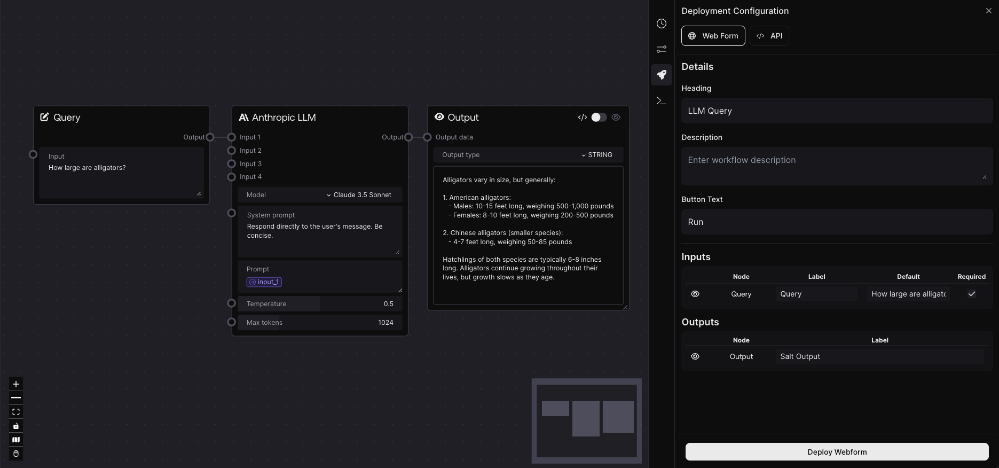
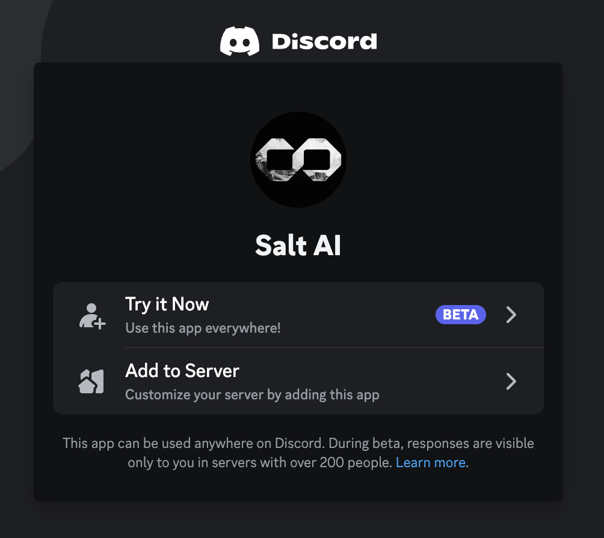
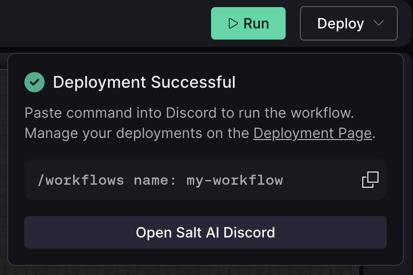
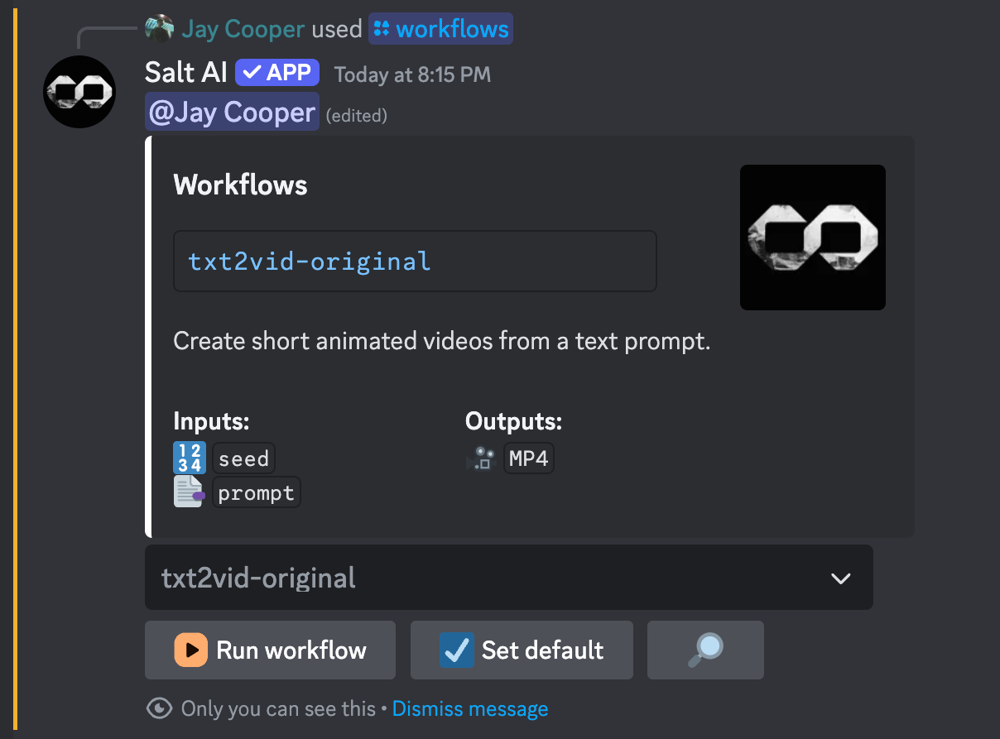
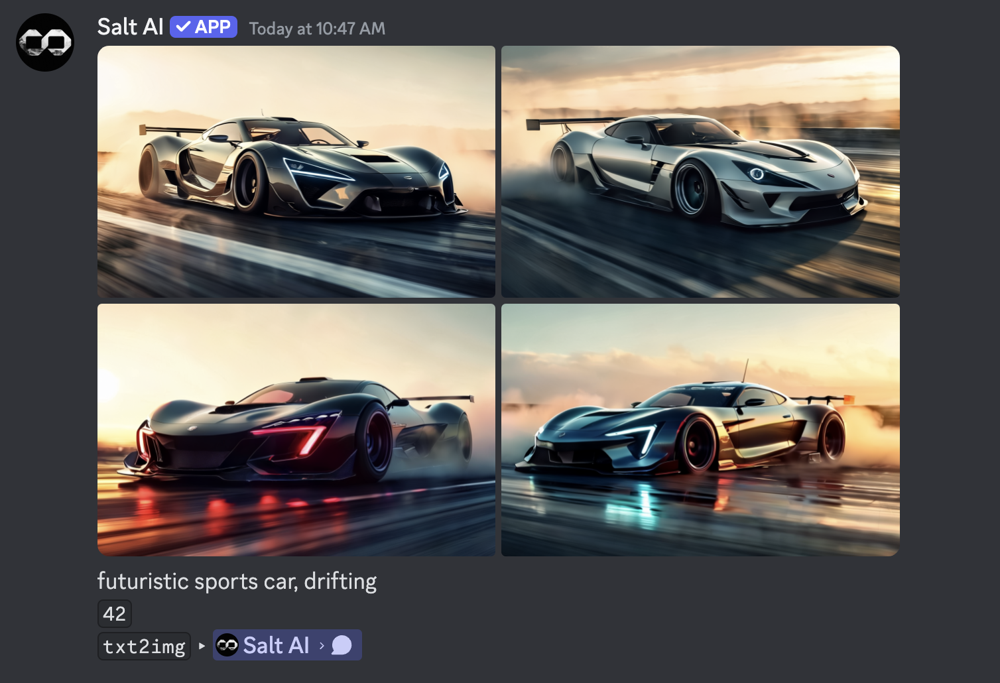

# Deploying and running workflows on Discord

## Deploying to Discord

With Salt, you can deploy and run your workflows through the `Salt AI` Discord bot.

When you’re ready to deploy, select the `Deploy` button in the top right corner. You will be prompted to give your workflow a name. Choose a unique, descriptive slug – your workflow will be discoverable by any Discord user using the Salt AI bot – then click `Deploy`.

You will see a confirmation screen when your deployment is complete. You can click to copy the workflow command to your clipboard.

You can manage and turn off your deployments at any time in the Deployments tab of your dashboard.

Salt’s Discord integration lets you easily put your workflows in the hands of real users as lightweight applications with no front-end development required. Keep reading to learn how.

## Installing the Salt AI Discord bot

You can easily add the Salt AI bot to any server or to your own account (accessible by DM) by selecting the `Add to Server` button [here](https://discord.com/oauth2/authorize?client_id=1113909066587185274) or on the deployment confirmation screen.

## Running workflows in Discord

Once your workflow has been deployed to Discord, it is ready to be used by you and other users.

In any server with the Salt AI bot added, use the `/workflows` command to open the directory. You can enter the name of your workflow directly, copy and paste it, or simply type the `/workflows` command with your workflow’s name (example: `/workflow sample-workflow`) in the chat field to get started.

Once your workflow is selected, click `Run workflow` to execute it. You can then fill in the workflow's input values, one for each `SaltInput` node in your workflow. Enter your string & integer values and click `Submit`. If the workflow has image or file attachments, you will be prompted to upload them in your direct messages.
Once the required inputs are filled in, your workflow will execute, and the outputs will appear in the thread or channel where you posted your message when they are finished generating.

## Showcasing your workflows in the Salt catalog

To share your workflows with the others in the community, first **[join the Salt Discord](https://discord.gg/saltai)** and complete onboarding.

Then, head to the **[#flow-catalog](https://discord.gg/FcbmPDf3E7)** channel and follow the example template to share your workflow. Be sure to run it using the Salt AI bot in a comment below and pin the comment, so others can easily find it and run it themselves.

## Troubleshooting errors

Sometimes, executions can fail based on errors in the workflow, such as invalid API keys. To fix this, you may have to make adjustments to the workflow, or [get in touch with our support team](https://discord.com/channels/1151592612525002822/1212167911771217961) for help.
Connection errors may also result in failed generation, or results that won't return even if the workflow is valid. In this case, you can `right-click` (or tap-hold on mobile) > `Apps` and select `Retry`. The execution will be run again, and could return a successful result if the issue was related to connection.

## Need help?

This guide is based on the beta version of Salt. Should you run into any issues or have questions, get in touch with our team via the [#support](https://discord.com/channels/1151592612525002822/1212167911771217961) channel in our Discord.
